# 有趣的大模型项目
- [English_readme](./README_en.md)
- [**基于MiniCPMV2.0的跨模态搜索**](#基于MiniCPMV2的跨模态搜索)
- [**冷启动构造function call数据**](#冷启动获取Agent数据)
- [**AutoPlan 复杂agent**](#复杂agent项目)
- [**AutoPlan2 冷启动构建复杂agent**](https://github.com/LDLINGLINGLING/AutoPlan2/tree/main)
- [MBTI角色扮演](#mbti角色扮演)
- [MiniCPMV混合模态微调](#混合模态微调)
- [4G显存玩转RAG](#4g显存玩转rag)
- [MiniCPMV2.6的AWQ量化](#minicpmv26的awq量化)
- [如何获取MiniCPMV的图像和文字嵌入向量](#获取MiniCPMV的图片和文本向量)
- [文字定位与识别](#ocr_vg)
- [法律问答智能助手RAFT](https://github.com/LDLINGLINGLING/rag-of-law)
- [定制具有特定风格的聊天机器人](https://github.com/LDLINGLINGLING/Style-ChatBot)
- [带有交叉熵的正则化DPO训练](#带有交叉熵的正则化DPO训练)
- [为MiniCPM4适配了EAGLE3的投机解码模型](https://github.com/LDLINGLINGLING/Eagle3_for_MiniCPM4)

以上项目都是个人原创，如果需要可自取，但是注意保护我的个人知识产权，用了给个星星。

## OCR_VG

同时将OCR和定位任务融合，考虑排版问题，该项目在OCR_VG的文件夹下，在可以自取[文字识别与定位教程](https://modelbest.feishu.cn/wiki/HLRiwNgKEic6cckGyGucFvxQnJw?from=from_copylink)。

### 项目效果

<div align="center"> 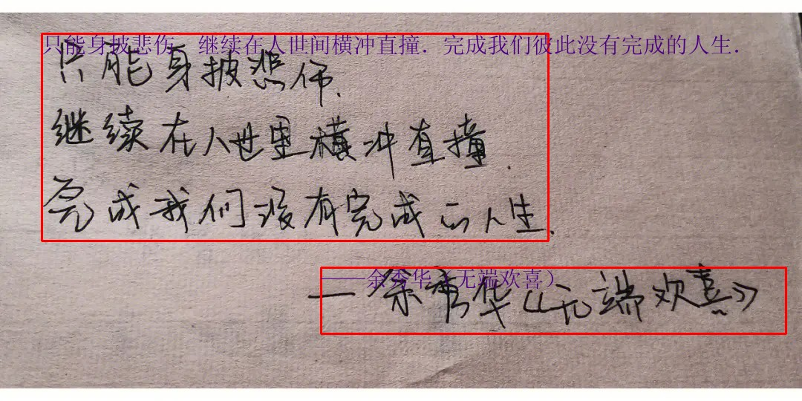 <br />  </div>

## 基于MiniCPMV2的跨模态搜索

使用多向量和对比学习的方法，目标是训练一个跨模态端到端搜索的模型，可以理解密集文字、复杂表格。[模型地址](https://www.modelscope.cn/models/linglingdan/Minicpmv_embeding_multi_vector)

### 效果展示：

1. 输入待选图片：
   <div align="center">
     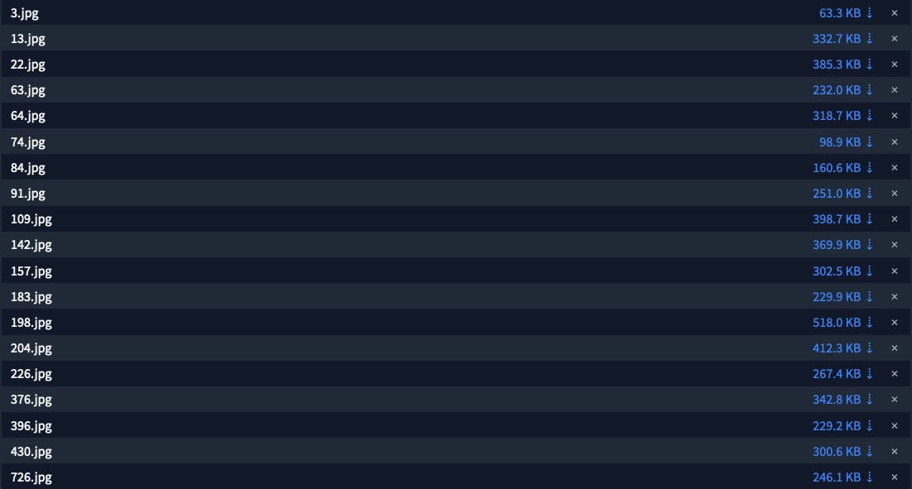
   </div>
2. 输入query文字进行搜索:
   <div align="center">
     
   </div>
3. 得到与query最相近的图片。
   <div align="center">
     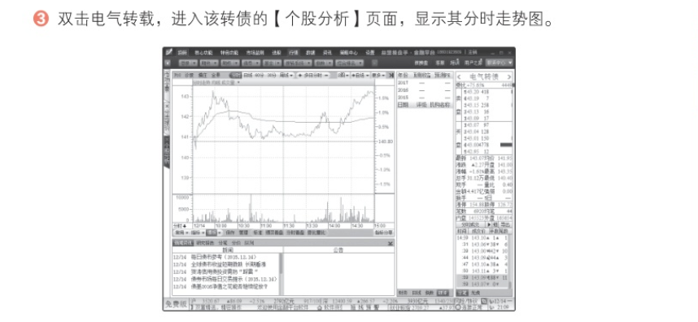
   </div>
4. 实验结果：
   300条验证集图文对，Top1匹配正确率高达96%。
   
### 使用教程

见[飞书文档](https://modelbest.feishu.cn/docx/CGEzdu25MoXkoVx3Qoac0e25nvg?from=from_copylink)

## 冷启动获取Agent数据
为了快速构建Agent，搭建了大模型生成agent训练数据的工具,告别刀耕火种，节约你95%的时间。包括qwen模型(react)和minicpm两种格式生成。
### 零人工修改数据演示(节选)
```
[
{
        "instruction": "You are a helpful assistant.",
        "input": "Answer the following questions as best you can. You have access to the following tools:\n\nimage_gen_prompt: Call this tool to interact with the 图生文 API. What is the 图生文 API useful for? 图生文是一个可以看图生成文字描述的服务，输入一张图片的地址，将返回图片详细逼真的表述 Parameters: [{\"name\": \"image_path\", \"description\": \"需要图片描述的URL或者本地地址\", \"scope\": null, \"required\": true, \"schema\": {\"type\": \"string\"}}] Format the arguments as a JSON object.\n\nknowledge_graph: Call this tool to interact with the 知识图谱 API. What is the 知识图谱 API useful for? 知识图谱是输入武器种类获取该武器的属性，也可以输入某种属性获得所有武器的该属性 Parameters: [{\"name\": \"weapon_query\", \"description\": \"武器名称\", \"scope\": [\"直升机\", \"坦克\", \"反坦克导弹\", \"直升机\", \"火箭炮\", \"所有武器\"], \"required\": true, \"schema\": {\"type\": \"string\"}}, {\"name\": \"attribute\", \"description\": \"武器的属性\", \"scope\": [\"射程\", \"续航里程\", \"重量\", \"速度\", \"承载量\", \"适应场景\", \"克制武器\"], \"required\": true, \"schema\": {\"type\": \"string\"}}] Format the arguments as a JSON object.\n\nUse the following format:\n\nQuestion: the input question you must answer\nThought: you should always think about what to do\nAction: the action to take, should be one of [image_gen_prompt, knowledge_graph]\nAction Input: the input to the action\nObservation: the result of the action\n... (this Thought/Action/Action Input/Observation can be repeated zero or more times)\nThought: I now know the final answer\nFinal Answer: the final answer to the original input question\n\nBegin!\n\nQuestion: 请问图生文工具能描述出www.baidu.com/img/PCtm_d9c8 seventy-five zero bed zero b three c seven d zero eight nine fa seven d five five seven two zero d six cf png.jpg里的建筑物是哪个城市吗？（注：这里的文件名是为了保持连贯性而做了微调）",
        "output": "Thought: 我需要调用图生文API来获取图片的描述\nAction: image_gen_prompt\nAction Input: {\"image_path\": \"www.baidu.com/img/PCtm_d9c8_seventy-five_zero_bed_zero_b_three_c_seven_d_zero_eight_nine_fa_seven_d_five_five_seven_two_zero_d_six_cf_png.jpg\"}\nObservation: 一座雄伟的高楼矗立在城市中心，周围是繁华的商业区。这座建筑有着独特的外观设计，玻璃幕墙反射着阳光，显得格外耀眼。\nThought: 图生文API返回了图片描述\nFinal Answer: 这张图片中展示了一座位于城市中心的雄伟高楼。然而，图生文工具无法直接识别出具体的地理位置或建筑物名称。建议您根据其他信息来确定该建筑物所在的城市。"
    },
    {
        "instruction": "You are a helpful assistant.",
        "input": "Answer the following questions as best you can. You have access to the following tools:\n\nimage_gen_prompt: Call this tool to interact with the 图生文 API. What is the 图生文 API useful for? 图生文是一个可以看图生成文字描述的服务，输入一张图片的地址，将返回图片详细逼真的表述 Parameters: [{\"name\": \"image_path\", \"description\": \"需要图片描述的URL或者本地地址\", \"scope\": null, \"required\": true, \"schema\": {\"type\": \"string\"}}] Format the arguments as a JSON object.\n\nknowledge_graph: Call this tool to interact with the 知识图谱 API. What is the 知识图谱 API useful for? 知识图谱是输入武器种类获取该武器的属性，也可以输入某种属性获得所有武器的该属性 Parameters: [{\"name\": \"weapon_query\", \"description\": \"武器名称\", \"scope\": [\"直升机\", \"坦克\", \"反坦克导弹\", \"直升机\", \"火箭炮\", \"所有武器\"], \"required\": true, \"schema\": {\"type\": \"string\"}}, {\"name\": \"attribute\", \"description\": \"武器的属性\", \"scope\": [\"射程\", \"续航里程\", \"重量\", \"速度\", \"承载量\", \"适应场景\", \"克制武器\"], \"required\": true, \"schema\": {\"type\": \"string\"}}] Format the arguments as a JSON object.\n\nUse the following format:\n\nQuestion: the input question you must answer\nThought: you should always think about what to do\nAction: the action to take, should be one of [image_gen_prompt, knowledge_graph]\nAction Input: the input to the action\nObservation: the result of the action\n... (this Thought/Action/Action Input/Observation can be repeated zero or more times)\nThought: I now know the final answer\nFinal Answer: the final answer to the original input question\n\nBegin!\n\nQuestion: 我需要知道www.baidu.com/img/PCtm_d ninety-five oh bed oh b three c seven d o eight nine fa seven d five five seven two zero d six cf.jpg（注：这里的文件名是为了保持连贯性而做了微调）中的物品名称，请帮助。",
        "output": "Thought: 我需要使用图生文API来获取图片的描述，然后从描述中提取物品名称。\nAction: image_gen_prompt\nAction Input: {\"image_path\": \"www.baidu.com/img/PCtm_d ninety-five oh bed oh b three c seven d o eight nine fa seven d five five seven two zero d six cf.jpg\"}\nObservation: 一只黑白相间的猫坐在一张木桌上，背景是一面白色的墙。\nThought: 图片中主要的物品是“一只黑白相间的猫”和“一张木桌”。\nFinal Answer: 图片中的物品名称为：一只黑白相间的猫和一张木桌。"
    },
    {
        "instruction": "You are a helpful assistant.",
        "input": "Answer the following questions as best you can. You have access to the following tools:\n\nimage_gen_prompt: Call this tool to interact with the 图生文 API. What is the 图生文 API useful for? 图生文是一个可以看图生成文字描述的服务，输入一张图片的地址，将返回图片详细逼真的表述 Parameters: [{\"name\": \"image_path\", \"description\": \"需要图片描述的URL或者本地地址\", \"scope\": null, \"required\": true, \"schema\": {\"type\": \"string\"}}] Format the arguments as a JSON object.\n\nknowledge_graph: Call this tool to interact with the 知识图谱 API. What is the 知识图谱 API useful for? 知识图谱是输入武器种类获取该武器的属性，也可以输入某种属性获得所有武器的该属性 Parameters: [{\"name\": \"weapon_query\", \"description\": \"武器名称\", \"scope\": [\"直升机\", \"坦克\", \"反坦克导弹\", \"直升机\", \"火箭炮\", \"所有武器\"], \"required\": true, \"schema\": {\"type\": \"string\"}}, {\"name\": \"attribute\", \"description\": \"武器的属性\", \"scope\": [\"射程\", \"续航里程\", \"重量\", \"速度\", \"承载量\", \"适应场景\", \"克制武器\"], \"required\": true, \"schema\": {\"type\": \"string\"}}] Format the arguments as a JSON object.\n\nUse the following format:\n\nQuestion: the input question you must answer\nThought: you should always think about what to do\nAction: the action to take, should be one of [image_gen_prompt, knowledge_graph]\nAction Input: the input to the action\nObservation: the result of the action\n... (this Thought/Action/Action Input/Observation can be repeated zero or more times)\nThought: I now know the final answer\nFinal Answer: the final answer to the original input question\n\nBegin!\n\nQuestion: 我想知道坦克的射程是多少？",
        "output": "Thought: 我需要调用知识图谱API来获取坦克的射程信息。\nAction: knowledge_graph\nAction Input: {\"weapon_query\": \"坦克\", \"attribute\": \"射程\"}\nObservation: 该武器不存在，或该属性不存在，请检查输入。\nThought: 输入的武器名称和属性可能有误，我需要再次尝试获取信息。\nAction: knowledge_graph\nAction Input: {\"weapon_query\": \"坦克\", \"attribute\": \"射程\"}\n"
    }
]
```


[零修改生成数据示例](./agent_demo/react_qa_react.json)

[生成代码点击此处](./agent_demo/get_react_data.py)

[使用教程](https://modelbest.feishu.cn/docx/BvNxdOtVqonNXDxgXLbceXMdnMc?from=from_copylink)

## 复杂agent项目

使用minicpmv2.6完成了论文[AutoPlan](https://github.com/LDLINGLINGLING/AutoPlan)的项目，能够对复杂任务进行规划和执行。

### 效果展示：

1. 输入query:
   <div align="center">
     
   </div>
2. 获得任务分解
   <div align="center">
     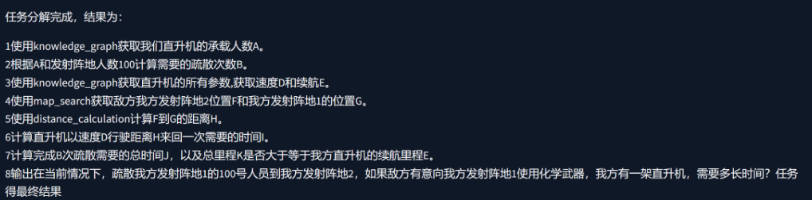
   </div>
3. 获得任务执行
   <div align="center">
     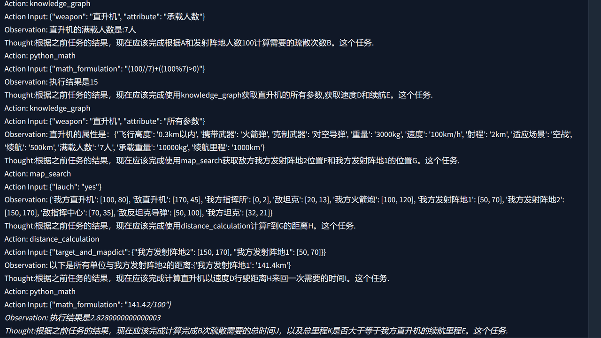
     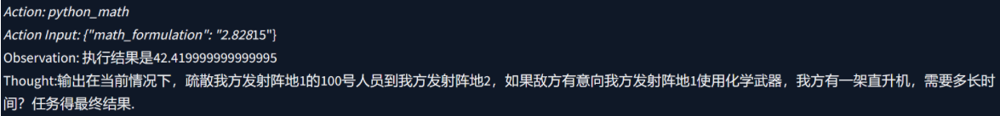
   </div>
4. 获得最终答案
   <div align="center">
      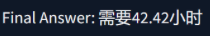
   </div>

### 使用教程

见[飞书文档](https://modelbest.feishu.cn/wiki/IgF0wRGJYizj4LkMyZvc7e2Inoe?from=from_copylink)

## MBTI角色扮演

与北大Chatlaw团队每个人格训练一个模型不同，仅使用一个2b模型完成了16种人格的无缝切换（可玩人格分裂）

### 使用教程

[角色扮演](https://modelbest.feishu.cn/docx/EcNjdGwvwoLkDrxpVrQcLwlknCg?from=from_copylink)

### 效果展示

<div align="center">
  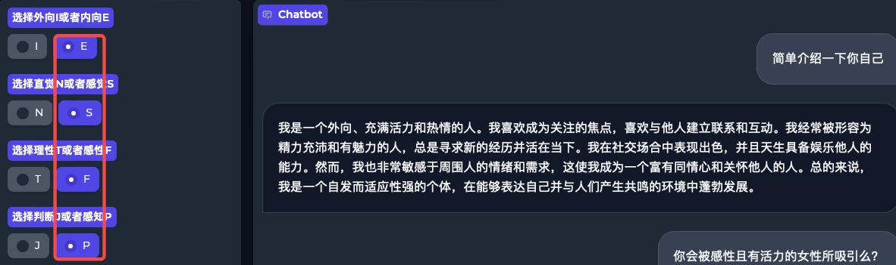
  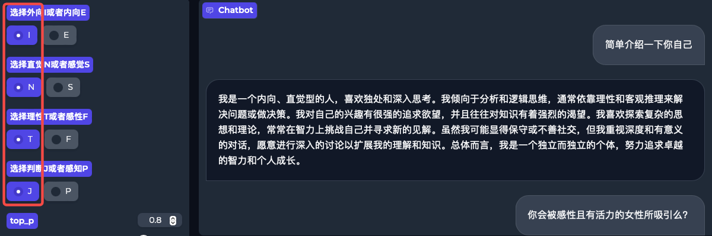
  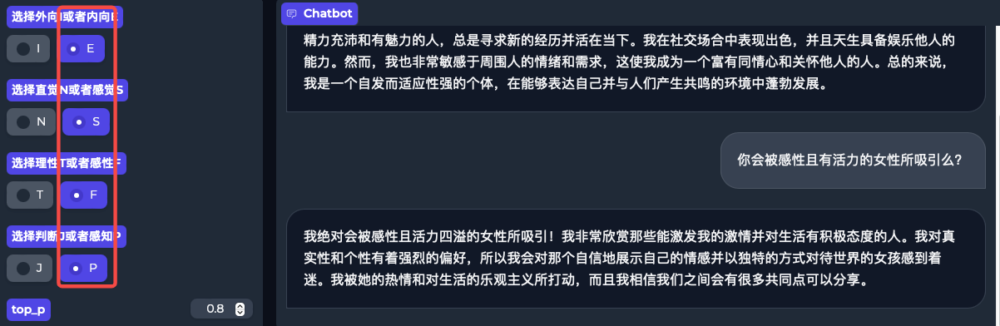
  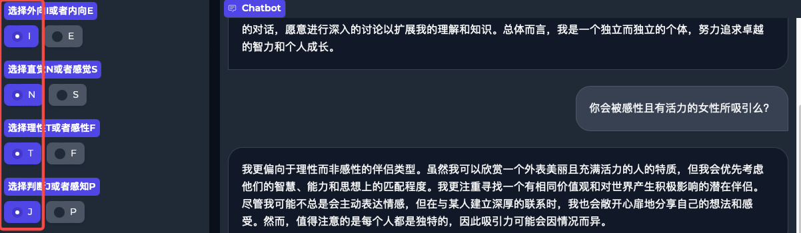
</div>

## 混合模态微调

MiniCPMV的微调仅仅开放了图文双模态的训练，本项目修改了纯文本和图文对的混合训练模式，放在了adan_application/ft_language_replace_file文件夹下，

### 使用教程

可以自取[混合模态微调教程](https://modelbest.feishu.cn/wiki/Y1NbwYijHiuiqvkSf0jcUOvFnTe?from=from_copylink)

对于对齐训练导致的语言模态能力下降是指的对齐后的多模态模型mllm，对于纯语言输入的回复能力有所下降，俗称对齐税（本质上也许是另外一种灾难性遗忘）。对于抑制灾难性遗忘一种比较简单的方法是混入原始数据，对于多模态的语言能力丢失，则是混入语言数据。这就迎来了另外一个问题，混入哪些语言数据，占比又是多少，这不是本文的重点，笔者亦无力解决这个问题。但是对于应用来说，mllm并不需要十项全能的语言能力，更多的是在有优秀的多模态能力下保持基础问答以及某一个领域的专业的回复能力。

## 4G显存玩转RAG

<div align="center">
  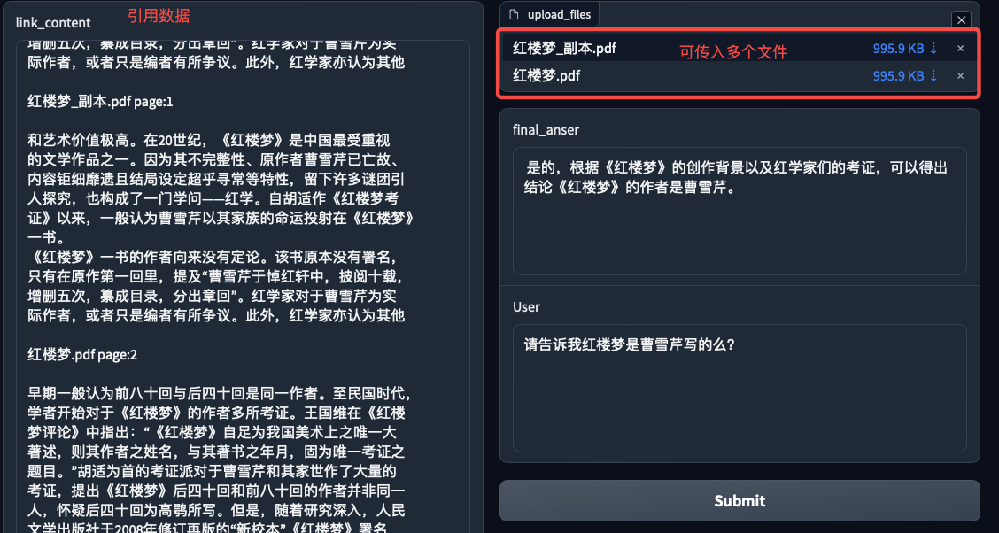
  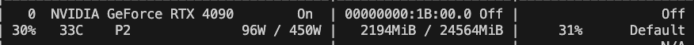
</div>

这个没什么好解释的，可以在极低显存下运行RAG，

### 使用教程

教程自取[RAG](https://modelbest.feishu.cn/wiki/G5NlwYGGAiJWGmkCc4NcQ3sAnms?from=from_copylink)

## MiniCPMV2.6的AWQ量化

由于bnb量化的minicpmv2.6无法用vllm加载，因此适配了autoawq，目前已经向autoawq提了pr，等合并后可以直接使用。

### 使用教程
[飞书教程地址](https://modelbest.feishu.cn/wiki/PAsHw6N6xiEy0DkJWpJcIocRnz9?from=from_copylink)
使用方法如下：

1. 获取个人autoawq分支
   ```bash
   git clone https://github.com/LDLINGLINGLING/AutoAWQ
   cd AutoAWQ
   git checkout minicpmv2.6
   pip install e .
   ```
2. 将MiniCPM_Series_Tutorial/MiniCPMV2_6_awq/modeling_minicpmv.py文件替换掉minicpmv2.6模型保存路径下的同名文件
3. 修改MiniCPM_Series_Tutorial/MiniCPMV2_6_awq/quantize.py中的model_path为你minicpmv2.6的保存路径。
4. 运行quantize.py

获得minicpmv2.6的awq模型后可以使用原来的vllm进行部署，部署方式完全相同,模型从16g显存将为7g显存
<div align="center">
  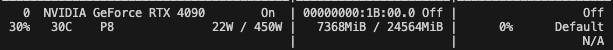
</div>

## 获取MiniCPMV的图片和文本向量
### MiniCPM-V 嵌入项目操作指南

#### 1. 下载项目代码

首先，你需要从GitHub上克隆本项目 `adan_application` 项目代码。

```sh
git clone https://github.com/LDLINGLINGLING/adan_application.git
```

#### 2. 替换原始模型代码

接下来，用下载的项目中的 `modeling_minicpmv.py` 文件替换本地 `MiniCPMV2.6` 模型路径下的同名文件。

```sh
cp adan_application/get_minicpmv2.6_embeding/modeling_minicpmv.py /path/to/MiniCPM-V-2_6/modeling_minicpmv.py
```

请确保将 `/path/to/MiniCPMV2.6` 替换为你本地 `MiniCPMV2.6` 项目的实际路径。

#### 3. 编写模型地址及其他参数

修改 `adan_application/get_minicpmv2.6_embeding/inference.py` 文件中的 `main` 函数来设置以下参数：

```python
def main() -> None:
    images = ['/root/ld/ld_dataset/30k_data/60938244/42.jpg']  # 图像路径列表，例如：['/ld/image_path/1.jpg', '/ld/image_path/2.jpg']
    queries = ['hello']  # 文本查询列表，例如：["图片中有一只黑白相间的狗", "一个孩子正在吃棒棒糖"]
    model_name = "/root/ld/ld_model_pretrain/MiniCPM-V-2_6"  # 模型路径
```

#### 4. 运行 `inference.py` 获取嵌入向量

在 `inference.py` 文件中，添加以下代码来获取图像和文本的嵌入向量：

```python
import torch
from torch.utils.data import DataLoader
from tqdm import tqdm

def main() -> None:
    images = ['/root/ld/ld_dataset/30k_data/60938244/42.jpg']  # 图像路径列表，例如：['/ld/image_path/1.jpg', '/ld/image_path/2.jpg']
    queries = ['hello']  # 文本查询列表，例如：["图片中有一只黑白相间的狗", "一个孩子正在吃棒棒糖"]
    model_name = "/root/ld/ld_model_pretrain/MiniCPM-V-2_6"  # 模型路径

    # 加载模型
    model = ...  # 根据你的模型加载方法加载模型
    model.to("cuda")

    # 图像数据加载器
    image_dataloader = DataLoader(
        images,
        batch_size=1,
        shuffle=False,
        collate_fn=lambda x: data_collator_image(x),
    )

    # 获取图像嵌入向量
    for batch_img in tqdm(image_dataloader):
        batch_img = {k: (v.to("cuda") if isinstance(v, torch.Tensor) else v) for k, v in batch_img.items()}
        with torch.no_grad():
            embeddings_img = model.get_vllm_embedding(batch_img)  # 在这里我们获取图像向量
            print(embeddings_img)

    # 文本数据加载器
    dataloader = DataLoader(
        queries_dataset,
        batch_size=1,
        shuffle=False,
        collate_fn=lambda x: data_collator_query(x),
    )

    # 获取文本嵌入向量
    for batch_text in tqdm(dataloader):
        with torch.no_grad():
            batch_text = batch_text.to("cuda")
            embeddings_query = model(data=batch_text, use_cache=False).logits  # 在这里我们获取文本向量
            print(embeddings_query)

if __name__ == '__main__':
    main()
```

## RAG_Of_Law: 基于RAFT框架的法律问答系统

### 项目概述
本项目采用RAFT(Retrieval-Augmented Fine-Tuning)技术框架，构建面向法律领域的专业问答系统。通过结合检索增强生成(RAG)和监督微调(SFT)，显著提升模型在复杂法律问题上的回答准确性和专业性。

GitHub地址: [https://github.com/LDLINGLINGLING/rag-of-law](https://github.com/LDLINGLINGLING/rag-of-law)

### 技术架构
用户提问 → 分类模型 → 法律类别判定 → 语义检索 → LLM生成 → 专业回答


### 核心组件

#### 1. 分类模型
- 使用BERT-base架构
- 两级分类体系：
  - 12个法律大类（准确率98.5%）
  - 115个法律子类（准确率97.6%）

#### 2. 语义检索模型
- 对比学习训练
- BM25混合检索

#### 3. 生成模型
- 抗噪声输入设计
- 专业表述重构
- 支持多轮对话

### 数据集

#### 法律条款库
```json
[
  ["民法", "合同法", "第五百条 当事人应当遵循诚信原则..."],
  ["刑法", "刑法修正案(十一)", "三十二、将刑法第一百四十一条修改为..."]
]
```
#### 法律数据集
```json
{
  "question": "公司未制止性骚扰的责任",
  "answer": "根据《妇女权益保障法》第八十条...",
  "references": [
    "第七十九条 违反报告义务的处罚",
    "第八十条 性骚扰处置责任"
  ]
}
```
## [构建具有特定风格的聊天机器人](https://github.com/LDLINGLINGLING/Style-ChatBot)
本项目在于构建垂直领域的聊天机器人
###  项目目标：
1. 构造一个大学生心理咨询机器人。
2. 能够耐心、热情、富有同情心、感染力的回复，数据需要带有这种风格（可以选择豆包进行蒸馏）。
3. 能够自主提问，并非简单的回答问题（在构造数据时需要提出这个要求）。
4. 能够根据学生的个人背景信息个性化回复（在训练数据的时候需要加入个人信息）。
5. 能够陪学生侃大山，天南地北的聊天，无bug（泛化性要好，不能有恶劣badcase）
### 技术路线：
1. 收集学生常见聊天场景（可大模型生成，需要多样性，保证模型训练的泛化性）
2. 总结学生用户背景如：学历、年纪、专业、性格、学校等等（可以大模型生成）
3. 收集真实的心理咨询师与大学生的对话数据集
4. 定义训练数据的轮数上限与轮数下限，并且定义单轮对话回复字数的上限与下限。
5. 书写prompt填写通用要求，比如：耐心、共情、主动提问、适当关心等等。
6. 随机选择话题场景、背景、真实数据集、轮数、单轮字数范围，并且加上Prompt构造多轮对话数据

## 带有交叉熵的正则化DPO训练
由于SFT训练过程中可以认为仅存在正样本，也就是大人（训练数据）只能教会小孩（模型）能做什么，但是不能教会他不能做什么。

DPO可以教会模型不能做什么，对于解决一些恶劣的badcase有奇效，但是可能存在的问题是在SFT后进行dpo训练将会导致SFT训练过程中获得的知识以及风格遗忘。

本项目的做法在于DPO过程中增加SFT损失作为正则项，减少DPO对齐过程中结果的遗忘问题。
### 使用方法
1. git clone https://github.com/LDLINGLINGLING/adan_application.git
2. cd sft_dpo_trainer
3. 修改sft_dpo.sh，并且运行训练
```bash
#!/bin/bash
python finetune_dpo_trainer.py \
    --model_name_or_path "/root/autodl-tmp/MiniCPM3-4B" \  # 预训练模型的路径
    --train_data_path "/root/autodl-tmp/dpo_train_data.json" \  # 训练数据路径（JSON格式）
    --eval_data_path "/root/autodl-tmp/dpo_train_data.json" \  # 验证数据路径（JSON格式）
    --output_dir "./output_dpo_sft" \  # 模型输出目录
    --num_train_epochs 3 \  # 训练轮数
    --per_device_train_batch_size 1 \  # 每个设备的训练批次大小
    --per_device_eval_batch_size 1 \  # 每个设备的验证批次大小
    --gradient_accumulation_steps 8 \  # 梯度累积步数（模拟更大的batch size）
    --learning_rate 5e-6 \  # 学习率
    --weight_decay 0.01 \  # 权重衰减（L2正则化）
    --warmup_steps 100 \  # 学习率预热步数
    --logging_steps 10 \  # 日志记录步数
    --save_steps 500 \  # 模型保存步数
    --eval_steps 500 \  # 验证步数
    --model_max_length 512 \  # 模型输入的最大长度
    --use_lora True \  # 是否使用LoRA（低秩适应）微调
    --bf16 True \  # 是否使用bfloat16混合精度训练
    --gradient_checkpointing True \  # 是否启用梯度检查点（节省显存）
    --dataloader_num_workers 4 \  # 数据加载的线程数
    --remove_unused_columns False \  # 是否移除未使用的列（通常设为False）
    --use_dpo True \  # 是否启用DPO训练
    --dpo_beta 0.1 \  # DPO的beta参数（控制KL散度的权重）
    --sft_loss_weight 0.5  # 监督微调（SFT）损失的权重
```

## [为MiniCPM4适配了EAGLE3的投机解码模型](https://github.com/LDLINGLINGLING/Eagle3_for_MiniCPM4)
EAGLE（Extrapolation Algorithm for Greater Language-model Efficiency）是一种创新的推测解码方法，通过训练轻量级的草稿模型来预测目标模型的下一个token，从而显著提升大语言模型的推理速度。 本项目为MiniCPM4适配EAGLE3的投机解码模型。
### 📊在14000条alpaca上训练的测试结果如下

| 预测位置 | 准确率 (%) | 准确率标准差 | 损失 | 损失标准差 |
|:--------:|:----------:|:------------:|:----:|:----------:|
| 位置 0 | 48.05 | ±7.58 | 0.8946 | ±0.3383 |
| 位置 1 | 48.72 | ±7.64 | 0.8844 | ±0.3379 |
| 位置 2 | 48.68 | ±8.03 | 0.8839 | ±0.3390 |
| 位置 3 | 48.40 | ±8.15 | 0.8884 | ±0.3411 |
| 位置 4 | 48.09 | ±8.18 | 0.8935 | ±0.3434 |
| 位置 5 | 47.34 | ±8.15 | 0.9006 | ±0.3467 |
| 位置 6 | 46.79 | ±7.89 | 0.9093 | ±0.3490 |


