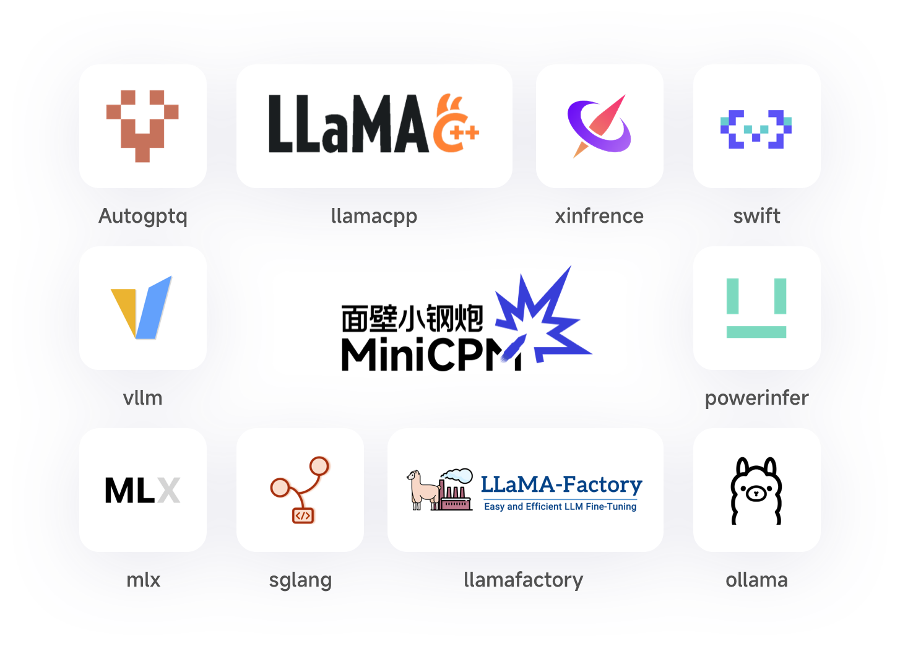

# MiniCPM_Series_Tutorial

</img> 

本仓库是MiniCPM系列的使用指南。 Minicpm是openbmb开源的最强大、最高效的gpt4级别端侧模型。

<a href="https://github.com/OpenBMB" target="_blank">MiniCPM 仓库</a> |
<a href="https://github.com/OpenBMB/MiniCPM-V/" target="_blank">MiniCPM-V 仓库</a> |
<a href="https://modelbest.feishu.cn/wiki/D2tFw8Pcsi5CIzkaHNacLK64npg" target="_blank">MiniCPM系列 知识库</a> |
<a href="https://github.com/LDLINGLINGLING/MiniCPM_Series_Tutorial/blob/main/README_application.md" target="_blank">MiniCPM 系列应用</a> |
加入我们的 <a href="https://discord.gg/3cGQn9b3YM" target="_blank">discord</a> 和 <a href="https://github.com/OpenBMB/MiniCPM/blob/main/assets/wechat.jpg" target="_blank">微信群</a>
 

# 目录和内容
## 关于MiniCPM系列(✅)
MiniCPM系列 是由面壁智能开发的一系列开放人工智能模型。MiniCPM 模型是最强大且成本效益最高的小型语言模型（SLMs），在多种语言、推理、长文本、工具调用、多模态、OCR等基准测试中表现出色，超越了许多同尺寸和更大尺寸的模型。MiniCPM 主要包括 language 和 vision 版本，可在手机、PC、Mac、车机、机器人等多种端侧设备上部署，以适应各种云端模型难以部署的应用场景。更多关于面壁智能 MiniCPM 家族的详细信息，请访问欢迎来到 [openbmb github](https://github.com/OpenBMB)页面。

## 技术报告(✅)
- [语言模型技术报告_正式](https://openbmb.vercel.app/?category=Chinese+Blog)
- [多模态模型技术报告_正式](https://arxiv.org/abs/2408.01800)
- [小钢炮注意力机制进化历程_解读](https://modelbest.feishu.cn/docx/JwBMdtwQ2orB5KxxS94cdydenWf?from=from_copylink)
- [多模态模型架构原理介绍_解读](https://modelbest.feishu.cn/wiki/X15nwGzqpioxlikbi2RcXDpJnjd?from=from_copylink)
- [多模态高清解码原理_解读](https://modelbest.feishu.cn/wiki/L0ajwm8VAiiPY6kDZfJce3B7nRg?from=from_copylink)
## 支持硬件（云端、边端）(✅)
- Gpu
- Cpu
- Npu
- android
- mac
## 模型地址与下载(✅)
- [MiniCPM2.0](https://huggingface.co/openbmb/MiniCPM-2B-sft-bf16)
- [MiniCPM3.0](https://huggingface.co/openbmb/MiniCPM3-4B)
- [MiniCPM-Llama3-V 2.5](https://huggingface.co/openbmb/MiniCPM-Llama3-V-2_5)
- [MiniCPM-V 2.6](https://huggingface.co/openbmb/MiniCPM-V-2_6)
## 推理部署(✅)
#### MiniCPM2.0
-  [MiniCPM2.0_transformers_cuda](./md/inference/minicpm2.0/transformers.md)
-  [MiniCPM2.0_vllm_cuda](./md/inference/minicpm2.0/vllm.md)
-  [MiniCPM2.0__mlx_mac](./md/inference/minicpm2.0/mlx.md)
-  [MiniCPM2.0_ollama_cuda_cpu_mac](./md/inference/minicpm2.0/ollama.md)
-  [MiniCPM2.0_llamacpp_cuda_cpu](./md/inference/minicpm2.0/llama.cpp_pc.md)
-  [MiniCPM2.0_llamacpp_android](./md/inference/minicpm2.0/llama.cpp_android.md)
-  [MiniCPM-S_powerinfer_cuda](./md/inference/minicpm2.0/powerinfer_pc.md)
-  [MiniCPM-S_powerinfer_android](./md/inference/minicpm2.0/powerinfer_android.md)
-  FAQ
#### MiniCPM3.0
-  [MiniCPM3.0_vllm_cuda](./md/inference/minicpm3.0/vllm.md)
-  [MiniCPM3.0_transformers_cuda_cpu](./md/inference/minicpm3.0/transformers.md)
-  [MiniCPM3.0_llamacpp_cuda_cpu](./md/inference/minicpm3.0/llamcpp.md)
#### MiniCPMV2.5
- [MiniCPM-Llama3-V 2.5_vllm_cuda](./md/inference/minicpmv2.5/vllm.md)
- [MiniCPM-Llama3-V 2.5_LMdeploy_cuda](./md/inference/minicpmv2.5/LMdeploy.md)
- [MiniCPM-Llama3-V 2.5_llamacpp_cuda_cpu](./md/inference/minicpmv2.5/llamacpp_pc.md)
- [MiniCPM-Llama3-V 2.5_ollama_cuda_cpu](./md/inference/minicpmv2.5/ollama.md)
- [MiniCPM-Llama3-V 2.5_transformers_cuda](./md/inference/minicpmv2.5/transformers_multi_gpu.md)
- [MiniCPM-Llama3-V 2.5_xinference_cuda](./md/inference/minicpmv2.5/xinference.md)
- [MiniCPM-Llama3-V 2.5_swift_cuda](./md/inference/minicpmv2.5/swift_python.md)
#### MiniCPMV2.6
- [MiniCPM-V 2.6_vllm_cuda](./md/inference/minicpmv2.6/vllm.md)
- [MiniCPM-V 2.6_vllm_api_server_cuda](./md/inference/minicpmv2.6/vllm_api_server.md)
- [MiniCPM-V 2.6_llamacpp_cuda_cpu](./md/inference/minicpmv2.6/llamacpp.md)
- [MiniCPM-V 2.6_transformers_cuda](./md/inference/minicpmv2.6/transformers_mult_gpu.md)
- [MiniCPM-V 2.6_swift_cuda](https://github.com/modelscope/ms-swift/issues/1613)
- FAQ
## 微调(✅)
#### MiniCPM3.0
- [MiniCPM3_llamafactory_sft_RLHF_cuda](./md/finetune/minicpm3.0/llama_factory.md)
#### MiniCPM2.0
- [MiniCPM2.0_官方代码_sft_cuda](./md/finetune/minicpm2.0/sft.md)
- [MiniCPM2.0_mlx_sft_lora_mac](./md/finetune/minicpm2.0/mlx_sft.md)
- [MiniCPM2.0_llamafactory_RLHF_cuda](./md/finetune/minicpm2.0/llama_factory.md)
- FAQ

#### MiniCPMV2.5
- [MiniCPM-Llama3-V 2.5_官方代码_cuda](./md/finetune/minicpmv2.5/sft.md)
- [MiniCPM-Llama3-V-2_5_swift_cuda](./md/finetune/minicpmv2.5/swift.md)
- [混合模态训练](https://modelbest.feishu.cn/wiki/Y1NbwYijHiuiqvkSf0jcUOvFnTe?from=from_copylink)
#### MiniCPMV2.6
- [MiniCPM-V 2.6_官方代码_sft_cuda](./md/finetune/minicpmv2.6/sft.md)
- [MiniCPM-V 2.6_swift_sft_cuda](https://github.com/modelscope/ms-swift/issues/1613)
- [混合模态训练](https://modelbest.feishu.cn/wiki/As5Ow99z3i4hrCkooRIcz79Zn2f?from=from_copylink) 
- FAQ
## 模型量化(✅)
#### MiniCPM2.0
- [MiniCPM2.0_awq量化](./md/quantize/minicpm2.0/awq.md)
- [MiniCPM2.0_gguf量化](./md/inference/minicpm2.0/llama.cpp_pc.md)
- [MiniCPM2.0_gptq量化](./md/quantize/minicpm2.0/gptq.md)
- [MiniCPM2.0_bnb量化](./md/quantize/minicpm2.0/bnb.md)
#### MiniCPM3.0
- [MiniCPM3_awq量化](./md/quantize/minicpm3.0/awq.md)
- [MiniCPM3_gguf量化](./md/inference/minicpm3.0/llamcpp.md)
- [MiniCPM3_gptq量化](./md/quantize/minicpm3.0/gptq.md)
- [MiniCPM3_bnb量化](./md/quantize/minicpm3.0/bnb.md)
#### MiniCPMV2.5
- [MiniCPM-Llama3-V 2.5bnb量化](./md/quantize/minicpmv2.5/bnb.md)
- [MiniCPM-Llama3-V 2.5gguf量化](./md/inference/minicpmv2.5/llamacpp_pc.md)
#### MiniCPMV2.6
- [MiniCPM-V 2.6_bnb量化](./md/quantize/minicpmv2.6/bnb.md)
- [MiniCPM-V 2.6_awq量化](./md/quantize/minicpmv2.6/awq.md)
- [MiniCPM-V 2.6_gguf量化](./md/inference/minicpmv2.6/llamacpp.md)
## 集成(✅)
- [langchain](./md/integrate/langchain.md)
- [openai_api](./md/integrate/opeai_api.md)
- chat_bot gradio
## 应用(✅)
### 语言模型
- [4G显存玩转rag_langchain](https://modelbest.feishu.cn/wiki/G5NlwYGGAiJWGmkCc4NcQ3sAnms?from=from_copylink) 
- [RLHF可控文本生成](https://modelbest.feishu.cn/wiki/ZEzGwgDgSi2Nk1kjAfFcrZn4nKd?from=from_copylink)
- [function_call](https://modelbest.feishu.cn/wiki/ARJtwko3gisbw5kdPiDcDIOvnGg?from=from_copylink)
- [AIPC-windows搭建Agent](https://modelbest.feishu.cn/wiki/N0tswVXEqipuSUkWc96comFXnnd?from=from_copylink)
### 多模态模型
- [跨模态高清检索](https://modelbest.feishu.cn/wiki/NdEjwo0hxilCIikN6RycOKp0nYf?from=from_copylink)
- [文字识别与定位](https://modelbest.feishu.cn/wiki/HLRiwNgKEic6cckGyGucFvxQnJw?from=from_copylink)
- [Agent入门](https://modelbest.feishu.cn/wiki/HKQdwbUUgiL0HNkSetjctaMcnrw?from=from_copylink)
- [长链条Agent如何构造](https://modelbest.feishu.cn/wiki/IgF0wRGJYizj4LkMyZvc7e2Inoe?from=from_copylink)
- [多模态文档RAG](https://modelbest.feishu.cn/wiki/NwhIwkJZYiHOPSkzwPUcq6hanif?from=from_copylink)

## 开源社区合作(✅)
- [xtuner](https://github.com/InternLM/xtuner): [MiniCPM高效率微调的不二选择](https://modelbest.feishu.cn/wiki/AIU3wbREcirOm9kkvd7cxujFnMb#AMdXdzz8qoadZhxU4EucELWznzd)
- [LLaMA-Factory](https://github.com/hiyouga/LLaMA-Factory.git)：[MiniCPM微调一键式解决方案](https://modelbest.feishu.cn/wiki/AIU3wbREcirOm9kkvd7cxujFnMb#BAWrdSjXuoFvX4xuIuzc8Amln5E)
- [ChatLLM框架](https://github.com/foldl/chatllm.cpp)：[在CPU上跑MiniCPM](https://huggingface.co/openbmb/MiniCPM-2B-dpo-bf16/discussions/2#65c59c4f27b8c11e43fc8796)

