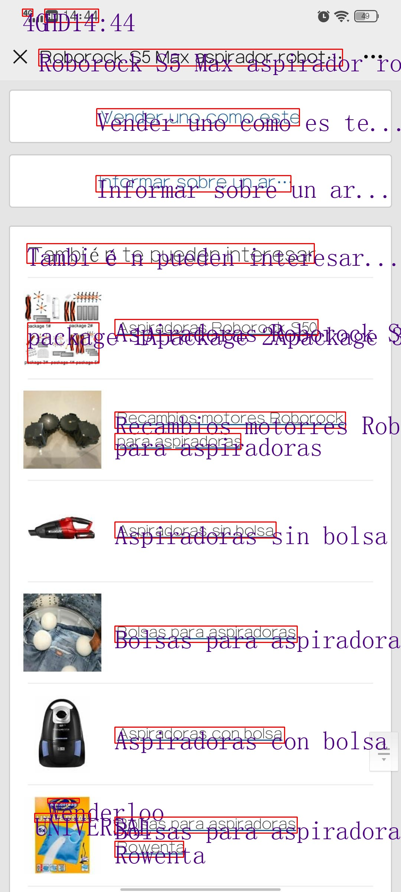
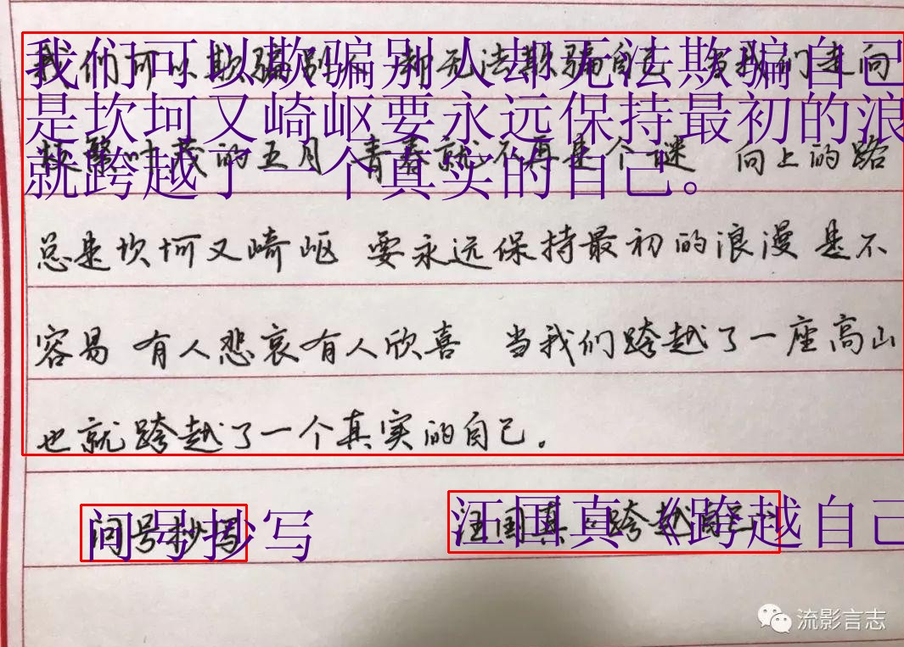

# MIniCPM_Series_Tutorial

本人是openbmb负责开源社区的同学，modelbest(面壁智能)一直致力降低大模型使用门槛，提高模型知识密度，让大模型飞入千家万户。
为此我写了minicpm和MiniCPM-Llama3-V 2.5的教程，包括推理，量化，边端部署，微调，技术报告，应用六个主题，基于MiniCPM的应用我会上传到本仓库。
地址如下：

https://modelbest.feishu.cn/wiki/D2tFw8Pcsi5CIzkaHNacLK64npg?from=from_copylink

b站配套视频：

https://space.bilibili.com/669720247?spm_id_from=333.1007.0.0

b站up名称：

面壁的车辆工程师

## 有趣的项目
以下项目都是个人原创，如果需要可自取，但是注意保护我的个人知识产权，用了给个星星。

### OCR_VG
同时将OCR和定位任务融合，考虑排版问题，该项目在OCR_VG的文件夹下，在可以自取[文字识别与定位教程](https://modelbest.feishu.cn/wiki/D2tFw8Pcsi5CIzkaHNacLK64npg?from=from_copylink)。以下是项目效果

### 混合模态微调
MiniCPMV的微调仅仅开放了图文双模态的训练，本项目修改了纯文本和图文对的混合训练模式，放在了MIniCPM_Series_Tutorial/ft_language_replace_file文件夹下，可以自取[混合模态微调教程](https://modelbest.feishu.cn/wiki/Y1NbwYijHiuiqvkSf0jcUOvFnTe?from=from_copylink)
对于对齐训练导致的语言模态能力下降是指的对齐后的多模态模型mllm，对于纯语言输入的回复能力有所下降，俗称对齐税（本质上也许是另外一种灾难性遗忘）。
对于抑制灾难性遗忘一种比较简单的方法是混入原始数据，对于多模态的语言能力丢失，则是混入语言数据。这就迎来了另外一个问题，混入哪些语言数据，占比又是多少，这不是本文的重点，笔者亦无力解决这个问题。
但是对于应用来说，mllm并不需要十项全能的语言能力，更多的是在有优秀的多模态能力下保持基础问答以及某一个领域的专业的回复能力。

### 4g显存玩转rag

这个没什么好解释的，可以在极低显存下运行rag，教程自取[RAG](https://modelbest.feishu.cn/wiki/G5NlwYGGAiJWGmkCc4NcQ3sAnms?from=from_copylink)
