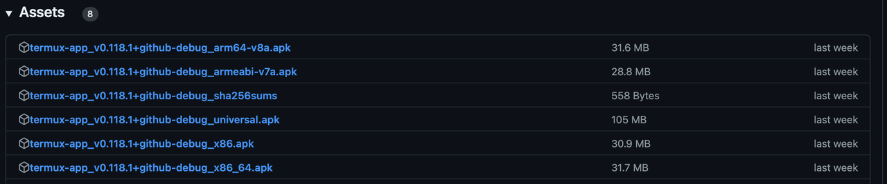

# 在安卓手机上部署PowerInfer

## 设备需求
- 安卓手机
- 推荐使用骁龙8系列及以上芯片的手机

### 步骤1：安装Termux

在手机上下载并安装合适的Termux版本，推荐使用[v0.118.1版本](https://github.com/termux/termux-app/releases/tag/v0.118.1)。



### 步骤2：授权Termux访问存储权限

打开Termux应用，并运行以下命令以授予Termux存储权限：

```sh
termux-setup-storage
```

运行两次以确保生效。

### 步骤3：获取编译环境（CMake 3.17+ 和 Python 3.8+）

#### 检查CMake版本

```sh
cmake --version
```

如果出现以下提示，则说明未安装CMake：
```
cmake: command not found
```

#### 安装CMake 3.17+

如果CMake版本不符合要求，则安装CMake 3.17+；否则跳过此步骤。

```sh
# 下载安装包
sudo wget https://cmake.org/files/v3.23/cmake-3.23.0.tar.gz
# 解压安装包
sudo tar -zxvf cmake-3.23.0.tar.gz
# 配置安装环境
sudo ./configure
sudo make -j8
# 编译安装
sudo make install
# 查看安装后的版本
cmake --version
# 返回版本号则安装成功
# cmake version 3.23.0
```

#### 获取合适版本的Python

```sh
python3 --version
```

如果Python版本低于3.8或者未安装，则运行以下命令；否则跳过此步骤。

```sh
pkg install python=3.8
```

再次测试Python版本，确保版本不低于3.8。

```sh
python3 --version
```

### 步骤4：获取PowerInfer代码并安装依赖包

在Termux的根目录下获取PowerInfer代码，并安装依赖包。

```sh
cd ~
git clone https://github.com/SJTU-IPADS/PowerInfer
cd PowerInfer
pip install -r requirements.txt
```

### 步骤5：获取MiniCPM-S-1B-sft-gguf模型

#### 方法1：Termux端获取模型文件

```sh
cd ~
git clone https://huggingface.co/openbmb/MiniCPM-S-1B-sft-gguf/tree/main
```

#### 方法2：先下载到PC，再用ADB传入手机

1. **PC端下载模型，ADB传到手机download**

   ```sh
   git clone https://huggingface.co/openbmb/MiniCPM-S-1B-sft-gguf/tree/main
   adb push /your/path/MiniCPM-S-1B-sft-gguf /sdcard/download
   ```

2. **Termux操作**

   ```sh
   cd ~
   cp /sdcard/download/MiniCPM-S-1B-sft-gguf .
   ```

### 步骤6：编译PowerInfer

在Termux环境下编译PowerInfer。

```sh
cd PowerInfer
cmake -S . -B build
cmake --build build --config Release
```

### 步骤7：对模型进行量化（建议操作，但非必要）

```sh
./build/bin/quantize ~/MiniCPM-S-1B-sft.gguf ~/minicpm_s_q4.gguf Q4_0
```

### 步骤8：模型推理

在PowerInfer目录下进行推理。

#### FP16模型推理

```sh
./build/bin/main -m ~/MiniCPM-S-1B-sft.gguf -n 2048 -t 8 -p '<用户>hello,tell me a story please.<AI>'
```

#### INT4模型推理

```sh
./build/bin/main -m ~/minicpm_s_q4.gguf -n 2048 -t 8 -p '<用户>hello,tell me a story please.<AI>'
```

### 步骤9：推理速度

#### 设备信息

| 手机型号 | 芯片     | 内存   |
|----------|----------|--------|
| Redmi K50 Ultra | 骁龙8+ | 12GB  |

#### 推理性能

| 模式     | 性能（token/s） |
|----------|-----------------|
| Prefill  | 16.82           |
| Decode   | 17.06           |
#### 实例展示


现在您可以开始在安卓设备上使用PowerInfer进行高效推理了！
