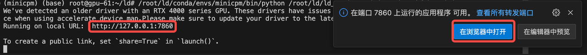

## 设置环境

1. 在命令行中输入以下命令来克隆MiniCPM仓库:
   ```bash
   git clone https://github.com/OpenBMB/MiniCPM.git
   ```

2. 安装项目所需的依赖库:
   ```bash
   pip install -r requirements.txt
   ```

3. 打开`MiniCPM/demo/hf_demo.py`文件，并检查以下参数设置:
   ```python
   parser = argparse.ArgumentParser()
   parser.add_argument("--model_path", type=str, default="openbmb/MiniCPM-2B-dpo-fp16")
   parser.add_argument("--torch_dtype", type=str, default="bfloat16", choices=["float32", "bfloat16", "float16"])
   parser.add_argument("--server_name", type=str, default="127.0.0.1")
   parser.add_argument("--server_port", type=int, default=7860)
   args = parser.parse_args()
   ```

4. 如果您已下载模型并希望更改默认路径，请根据实际情况修改以下参数:
   ```diff
   - parser.add_argument("--model_path", type=str, default="openbmb/MiniCPM-2B-dpo-fp16")
   + parser.add_argument("--model_path", type=str, default="/root/ai/minicpm_model")
   ```

   如果您的显卡不是如A100、4090或H100这样的高端型号，建议将精度设置为`float16`:
   ```diff
   - parser.add_argument("--torch_dtype", type=str, default="bfloat16", choices=["float32", "bfloat16", "float16"])
   + parser.add_argument("--torch_dtype", type=str, default="float16", choices=["float32", "bfloat16", "float16"])
   ```

5. 最后，运行`hf_demo.py`脚本:
   ```bash
   python MiniCPM/demo/hf_demo.py
   ```
   
6. 网页端输入以上地址，或者点击浏览器中打开

7. enjoy it