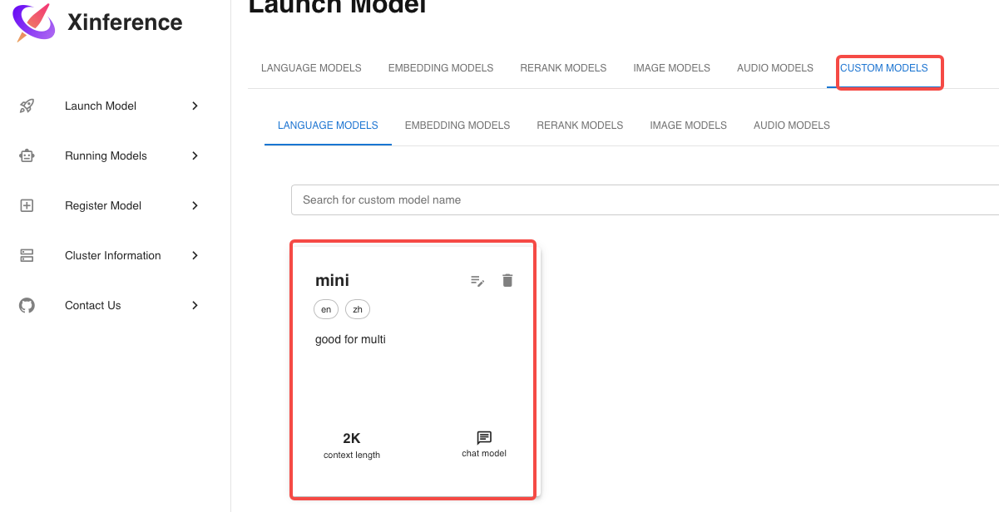

# Xinference 本地模型部署指南

## 步骤1：安装Xinference

安装Xinference及其所有可选依赖：

```sh
pip install "xinference[all]"
```

## 步骤2：运行Xinference

启动Xinference服务：

```sh
xinference
```

## 步骤3：注册新模型

注册新模型时，以下圈红位置为固定设置，其他字段可以根据需要自定义，最后点击“Register Model”。


## 步骤4：查找已注册的模型

模型注册完成后，前往“Custom Models”页面，找到刚刚注册的模型。



## 步骤5：运行模型

点击“Run”按钮来启动模型。


## 步骤6：启动WebUI

启动WebUI以便进行交互式推理。


## 步骤7：开始推理

现在您可以使用WebUI进行deploy模型推理了！


