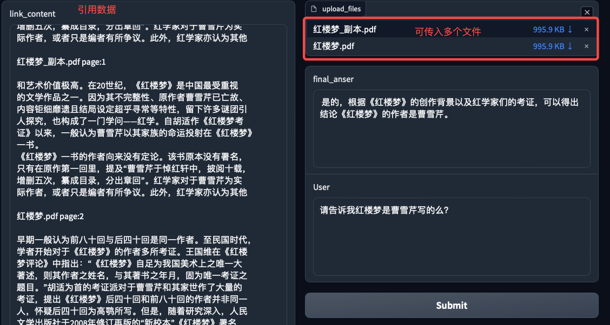
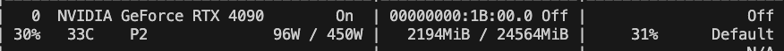

# RAG (Retrieval-Augmented Generation)简介
## 代码地址与使用
按照项目[4g显存玩转rag](https://github.com/OpenBMB/MiniCPM/blob/main/demo/langchain_demo.py)开头注释简单修改参数，即可运行。

## 什么是RAG？

RAG（Retrieval-Augmented Generation）是一种结合检索技术的生成模型方法，它首先通过检索系统找到与查询（Query）相关的背景知识，然后将这些背景知识提供给生成式语言模型（LLM），以生成更准确、可靠的回答。

## 为什么需要RAG？

尽管大型语言模型（LLM）已经能够在许多领域提供有效的答案，但由于它们本质上是基于历史数据训练的概率模型，因此对于训练数据中未覆盖的新问题或者需要最新信息的问题，LLM可能会产生不准确甚至错误的回答。RAG通过引入与查询相关的外部知识来补充LLM的能力，从而提高回答的质量。

## RAG的基本流程

1. **训练检索模型**：例如使用`bge-base-zh`模型，用于将查询和知识数据编码成向量。
2. **编码查询与数据**：使用检索模型对查询和待召回文本进行编码。
3. **计算相似度**：计算查询向量与所有数据向量之间的相似度，并选择最相关的前K个数据。
4. **重新排序**（可选）：对找到的相关文本进行进一步的排序优化。
5. **构建提示**：将查询和相关文本按照特定的提示模板组合起来输入给大型语言模型，生成最终答案。

## 示例代码

### 参数设置

```python
parser.add_argument(
    "--cpm_model_path",
    type=str,
    default="openbmb/MiniCPM-1B-sft-bf16",
    help="MiniCPM模型路径或者huggingface id"
)
parser.add_argument(
    "--cpm_device", type=str, default="cuda:0", choices=["auto", "cuda:0"],
    help="MiniCPM模型所在设备，默认为cuda:0"
)
parser.add_argument("--backend", type=str, default="torch", choices=["torch", "vllm"],
     help="使用torch还是vllm后端，默认为torch"
)

# 嵌入模型参数设置
parser.add_argument(
    "--encode_model", type=str, default="BAAI/bge-base-zh", 
    help="用于召回编码的embedding模型，默认为BAAI/bge-base-zh,可输入本地地址"
)
parser.add_argument(
    "--encode_model_device", type=str, default="cpu", choices=["cpu", "cuda:0"],
    help="用于召回编码的embedding模型所在设备，默认为cpu"
)
parser.add_argument("--query_instruction", type=str, default="",help="召回时增加的前缀")
parser.add_argument(
    "--file_path", type=str, default="/root/ld/pull_request/rag/红楼梦.pdf",
    help="需要检索的文本文件路径,gradio运行时无效"
)

# 生成参数
parser.add_argument("--top_k", type=int, default=3)
parser.add_argument("--top_p", type=float, default=0.7)
parser.add_argument("--temperature", type=float, default=0.7)
parser.add_argument("--max_new_tokens", type=int, default=4096)
parser.add_argument("--repetition_penalty", type=float, default=1.02)

# retriever参数设置
parser.add_argument("--embed_top_k", type=int, default=5,help="召回几个最相似的文本")
parser.add_argument("--chunk_size", type=int, default=256,help="文本切分时切分的长度")
parser.add_argument("--chunk_overlap", type=int, default=50,help="文本切分的重叠长度")
args = parser.parse_args()
```

### 继承LangChain的LLM

```python
class MiniCPM_LLM(LLM):
    tokenizer: Any = Field(default=None)
    model: Any = Field(default=None)

    def __init__(self, model_path: str):
        """
        继承langchain的MiniCPM模型
        
        参数:
        model_path (str): 需要加载的MiniCPM模型路径。

        返回:
        self.model: 加载的MiniCPM模型。
        self.tokenizer: 加载的MiniCPM模型的tokenizer。
        """
        super().__init__()
        if args.backend == "vllm":
            from vllm import LLM

            self.model = LLM(
                model=model_path, trust_remote_code=True, enforce_eager=True
            )
        else:
            self.tokenizer = AutoTokenizer.from_pretrained(
                model_path, trust_remote_code=True
            )
            self.model = AutoModelForCausalLM.from_pretrained(
                model_path, trust_remote_code=True, torch_dtype=torch.float16
            ).to(args.cpm_device)
            self.model = self.model.eval()

    def _call(self, prompt, stop: Optional[List[str]] = None):
        """
        langchain.llm的调用
        
        参数:
        prompt (str): 传入的prompt文本

        返回:
        responds (str): 模型在prompt下生成的文本
        """
        if args.backend == "torch":
            inputs = self.tokenizer("<用户>{}".format(prompt), return_tensors="pt")
            inputs = inputs.to(args.cpm_device)
            # Generate
            generate_ids = self.model.generate(
                inputs.input_ids,
                max_length=args.max_new_tokens,
                temperature=args.temperature,
                top_p=args.top_p,
                repetition_penalty=args.repetition_penalty,
            )
            responds = self.tokenizer.batch_decode(
                generate_ids,
                skip_special_tokens=True,
                clean_up_tokenization_spaces=False,
            )[0]
            # responds, history = self.model.chat(self.tokenizer, prompt, temperature=args.temperature, \
            # top_p=args.top_p, repetition_penalty=1.02)
        else:
            from vllm import SamplingParams

            params_dict = {
                "n": 1,
                "best_of": 1,
                "presence_penalty": args.repetition_penalty,
                "frequency_penalty": 0.0,
                "temperature": args.temperature,
                "top_p": args.top_p,
                "top_k": args.top_k,
                "use_beam_search": False,
                "length_penalty": 1,
                "early_stopping": False,
                "stop": None,
                "stop_token_ids": None,
                "ignore_eos": False,
                "max_tokens": args.max_new_tokens,
                "logprobs": None,
                "prompt_logprobs": None,
                "skip_special_tokens": True,
            }
            sampling_params = SamplingParams(**params_dict)
            prompt = "<用户>{}<AI>".format(prompt)
            responds = self.model.generate(prompt, sampling_params)
            responds = responds[0].outputs[0].text

        return responds

    @property
    def _llm_type(self) -> str:
        return "MiniCPM_LLM"
```

### 加载Embedding模型

```python
embedding_models = HuggingFaceBgeEmbeddings(
        model_name=args.encode_model,
        model_kwargs={"device": args.encode_model_device},  # 或者 'cuda' 如果你有GPU
        encode_kwargs={
            "normalize_embeddings": True,  # 是否归一化嵌入
            "show_progress_bar": True,  # 是否显示进度条
            "convert_to_numpy": True,  # 是否将输出转换为numpy数组
            "batch_size": 8,  # 批处理大小'
        },
        query_instruction=args.query_instruction,
    )
```

### 文档嵌入

```python
def embed_documents(documents, embedding_models):
    """
    对文档进行分割和嵌入
    
    参数:
    documents (list): 读取的文本列表
    embedding_models: embedding模型

    返回:
    vectorstore:向量数据库
    """
    text_splitter = RecursiveCharacterTextSplitter(
        chunk_size=args.chunk_size, chunk_overlap=args.chunk_overlap
    ) # 初始化了一个文字切分器
    texts = text_splitter.split_documents(documents) # 将文件进行文本切分，获得一个文本列表
    vectorstore = Chroma.from_documents(texts, embedding_models) # 将文本变为向量
    return vectorstore
```

### 查找最相似的文本

```python
docs = vectorstore.similarity_search(query, k=args.embed_top_k)
```

### 定义Prompt Template

```python
def create_prompt_template():
    """
    创建自定义的prompt模板
    
    返回:
    PROMPT:自定义的prompt模板
    """
    custom_prompt_template = """请使用以下内容片段对问题进行最终回复，如果内容中没有提到的信息不要瞎猜，
    严格按照内容进行回答，不要编造答案，如果无法从内容中找到答案，请回答“片段中未提及，无法回答”，不要编造答案。
    Context:
    {context}

    Question: {question}
    FINAL ANSWER:"""
    PROMPT = PromptTemplate(
        template=custom_prompt_template, input_variables=["context", "question"]
    )
    return PROMPT
```

### 定义LangChain流程
1. 首先将输入的query和高相关数据docs放入prompt这个模版中形成组合数据
2. 然后就会调用llm对组合数据进行推理，llm是继承langchain.llm的minicpm

```python
def create_rag_chain(llm, prompt):
    qa = prompt | llm
    return qa
```

### 调用RAG Chain

```python
final_result = rag_chain.invoke({"context": all_links, "question": query})
```

### Gradio前端


### 最低使用显存
已经是本次示例使用过程中最高显存消耗，共2.2G显存




# 4G显存使用方法

为了在有限的显存环境下运行RAG系统，可以采取以下步骤：

1. **量化模型**  
   根据MiniCPM的量化指南对`openbmb/MiniCPM-1B-sft-bf16`模型进行`int4`量化。推荐使用`AWQ`（AutoQuantization with Weight-only）方法进行量化。

2. **修改参数**  
   修改`MiniCPM/demo/langchain_demo.py`中的以下参数：
   ```python
   parser.add_argument(
       "--cpm_model_path",
       type=str,
       default="your/int4_cpm/save/path",
       help="MiniCPM模型路径或者huggingface id"
   )
   parser.add_argument(
       "--encode_model_device", type=str, default="cpu", choices=["cpu", "cuda:0"],
       help="用于召回编码的embedding模型所在设备，默认为cpu"
   )
   ```

3. **执行脚本**  
   运行`MiniCPM/demo/langchain_demo.py`。

---

# 速度优先方法

如果你更关心运行速度而不是显存使用，可以考虑以下配置：

1. **使用非量化模型**  
   不对MiniCPM模型进行量化处理，直接使用原始模型。

   ```python
   parser.add_argument(
       "--cpm_model_path",
       type=str,
       default="your/cpm/save/path",  # 量化模型一般在Torch后端速度会有所下降
       help="MiniCPM模型路径或者huggingface id"
   )
   ```

2. **使用vllm作为后端**  
   `vllm`后端通常能够提供更好的性能表现。

   ```python
   parser.add_argument("--backend", type=str, default="vllm", choices=["torch", "vllm"],
                        help="使用torch还是vllm后端，默认为torch"
   )
   ```

3. **将Embedding模型放入GPU**  
   将用于召回编码的Embedding模型部署到GPU上可以提升性能。

   ```python
   parser.add_argument(
       "--encode_model_device", type=str, default="cuda:0", choices=["cpu", "cuda:0"],
       help="用于召回编码的embedding模型所在设备，默认为cpu"
   )
   ```

4. **执行脚本**  
   运行`MiniCPM/demo/langchain_demo.py`。


