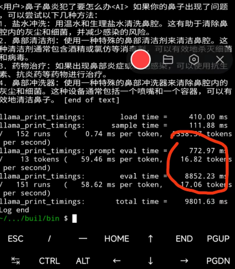

# Deploying PowerInfer on an Android Device

## Device Requirements
- Android smartphone
- It is recommended to use a phone with Snapdragon 8 series or higher chipset.

### Step 1: Install Termux

Download and install the appropriate version of Termux on your phone; it is recommended to use [version v0.118.1](https://github.com/termux/termux-app/releases/tag/v0.118.1).


### Step 2: Grant Storage Access Permissions to Termux

Open the Termux app and run the following command to grant storage permissions to Termux:

```sh
termux-setup-storage
```

Run it twice to ensure it takes effect.

### Step 3: Set Up the Compilation Environment (CMake 3.17+ and Python 3.8+)

#### Check CMake Version

```sh
cmake --version
```

If you see the following message, it means CMake is not installed:
```
cmake: command not found
```

#### Install CMake 3.17+

If the CMake version does not meet the requirement, install CMake 3.17+; otherwise, skip this step.

```sh
# Download the installation package
sudo wget https://cmake.org/files/v3.23/cmake-3.23.0.tar.gz
# Extract the installation package
sudo tar -zxvf cmake-3.23.0.tar.gz
# Configure the installation environment
cd cmake-3.23.0
sudo ./configure
sudo make -j8
# Compile and install
sudo make install
# Check the installed version
cmake --version
# If it returns the version number, the installation was successful
# cmake version 3.23.0
```

#### Get the Appropriate Version of Python

```sh
python3 --version
```

If the Python version is below 3.8 or not installed, run the following command; otherwise, skip this step.

```sh
pkg install python=3.8
```

Re-check the Python version to ensure it is at least 3.8.

```sh
python3 --version
```

### Step 4: Get PowerInfer Code and Install Dependencies

Get the PowerInfer code and install dependencies in the root directory of Termux.

```sh
cd ~
git clone https://github.com/SJTU-IPADS/PowerInfer
cd PowerInfer
pip install -r requirements.txt
```

### Step 5: Get the MiniCPM-S-1B-sft-gguf Model

#### Method 1: Get the Model File via Termux

```sh
cd ~
git clone https://huggingface.co/openbmb/MiniCPM-S-1B-sft-gguf/tree/main
```

#### Method 2: Download to PC First, Then Use ADB to Transfer to the Phone

1. **Download the model on PC and transfer it to the phone using ADB**

   ```sh
   git clone https://huggingface.co/openbmb/MiniCPM-S-1B-sft-gguf/tree/main
   adb push /your/path/MiniCPM-S-1B-sft-gguf /sdcard/download
   ```

2. **Termux Operations**

   ```sh
   cd ~
   cp /sdcard/download/MiniCPM-S-1B-sft-gguf .
   ```

### Step 6: Compile PowerInfer

Compile PowerInfer in the Termux environment.

```sh
cd PowerInfer
cmake -S . -B build
cmake --build build --config Release
```

### Step 7: Quantize the Model (Recommended but Not Mandatory)

```sh
./build/bin/quantize ~/MiniCPM-S-1B-sft.gguf ~/minicpm_s_q4.gguf Q4_0
```

### Step 8: Model Inference

Perform inference in the PowerInfer directory.

#### FP16 Model Inference

```sh
./build/bin/main -m ~/MiniCPM-S-1B-sft.gguf -n 2048 -t 8 -p '<User>hello, tell me a story please.<AI>'
```

#### INT4 Model Inference

```sh
./build/bin/main -m ~/minicpm_s_q4.gguf -n 2048 -t 8 -p '<User>hello, tell me a story please.<AI>'
```

### Step 9: Inference Speed

#### Device Information

| Phone Model | Chipset | RAM |
|-------------|---------|-----|
| Redmi K50 Ultra | Snapdragon 8+ | 12GB |

#### Inference Performance

| Mode      | Performance (token/s) |
|-----------|-----------------------|
| Prefill   | 16.82                 |
| Decode    | 17.06                 |

#### Example Demonstration



You are now ready to start using PowerInfer for efficient inference on your Android device!
