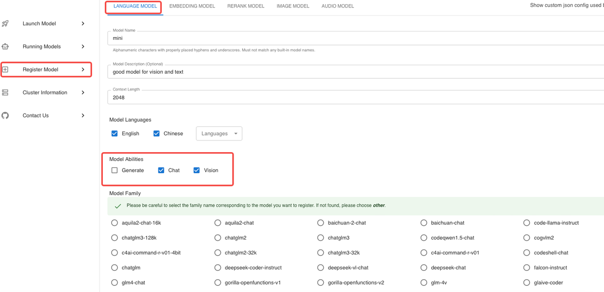
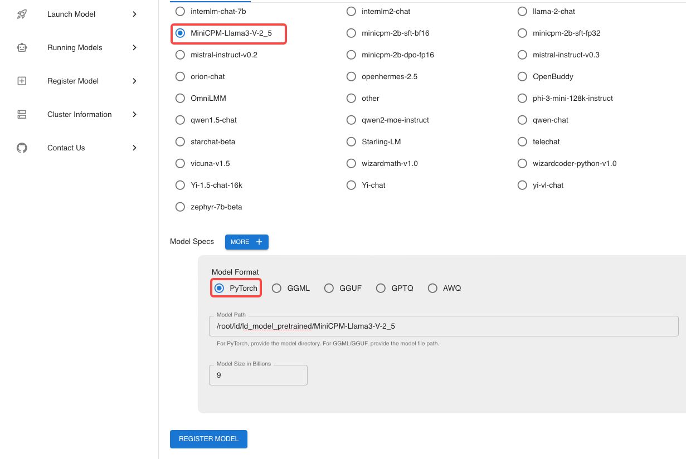
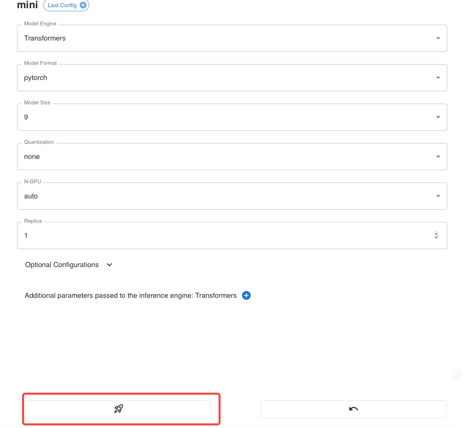
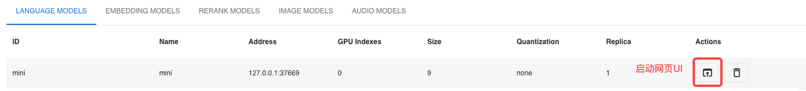

# Xinference Local Model Deployment Guide

## Step 1: Install Xinference

Install Xinference along with all its optional dependencies:

```sh
pip install "xinference[all]"
```

## Step 2: Run Xinference

Start the Xinference service:

```sh
xinference
```

## Step 3: Register a New Model

When registering a new model, the fields highlighted in red are fixed settings, while other fields can be customized as needed. Finally, click "Register Model."




## Step 4: Find the Registered Model

After the model is registered, navigate to the "Custom Models" page to find the newly registered model.


## Step 5: Run the Model

Click the "Run" button to start the model.



## Step 6: Launch WebUI

Launch the WebUI to enable interactive inference.



## Step 7: Start Inference

Now you can use the WebUI to perform model inference!

